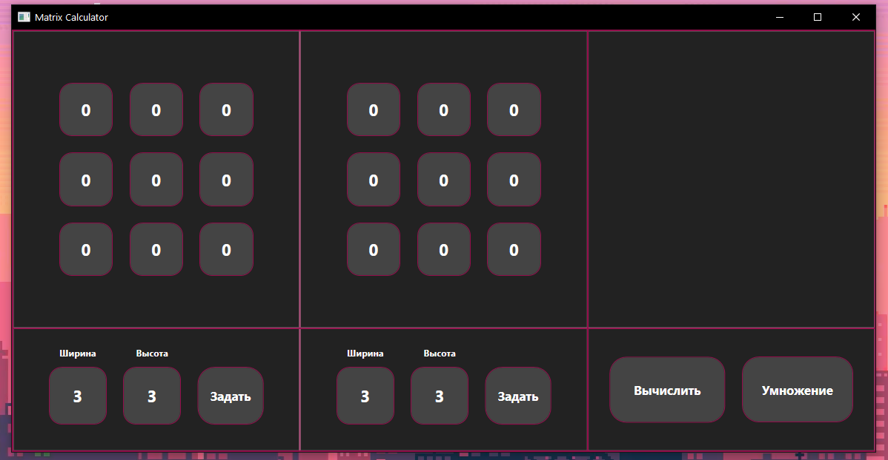
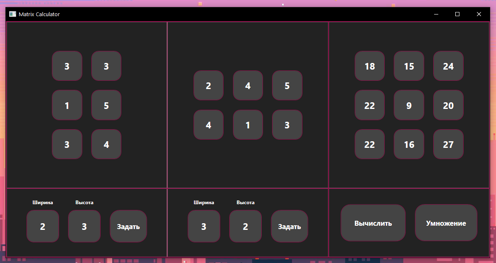
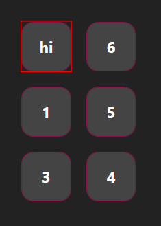

MatrixCalculator.WPF
====================

Десктопный фронтенд для матричного калькулятора

 

Функционал
----------

Приложение представляет из себя калькулятор для нескольких операций над
матрицами.

Калькулятор поддерживает следующие операции:

-   Сложение матриц

-   Вычитание матриц

-   Умножение матриц

-   Нахождение определителя

-   Нахождение обратной матрицы

Так выглядит UI калькулятора матриц на Windows -

В правом нижнем углу находиться ComboBox, при нажатии на который, всплывает меню
с выбором операции

Ввод матриц осуществляется нажатием на необходимую ячейку и ввода значения с
клавиатуры. Размеры же матриц задаются с помощью меню под матрицами. Числовые
значения задаются с клавиатуры, а при нажатии на кнопку “Задать” изменения
переходят на матрицу.

При нажатии на кнопку “Вычислить” справа появляется результирующая матрица или
число.

Если в матрицу вводятся неверные значения, то клетка с этим значением
оборачивается красной рамкой.

Инструкция по сборке
--------------------

Скачайте репозиторий с бизнес-логикой и добавьте папку рядом с текущим проектом

Репозиторий с бизнес-логикой: https://github.com/HexaLopata/MatrixCalculator.BL
